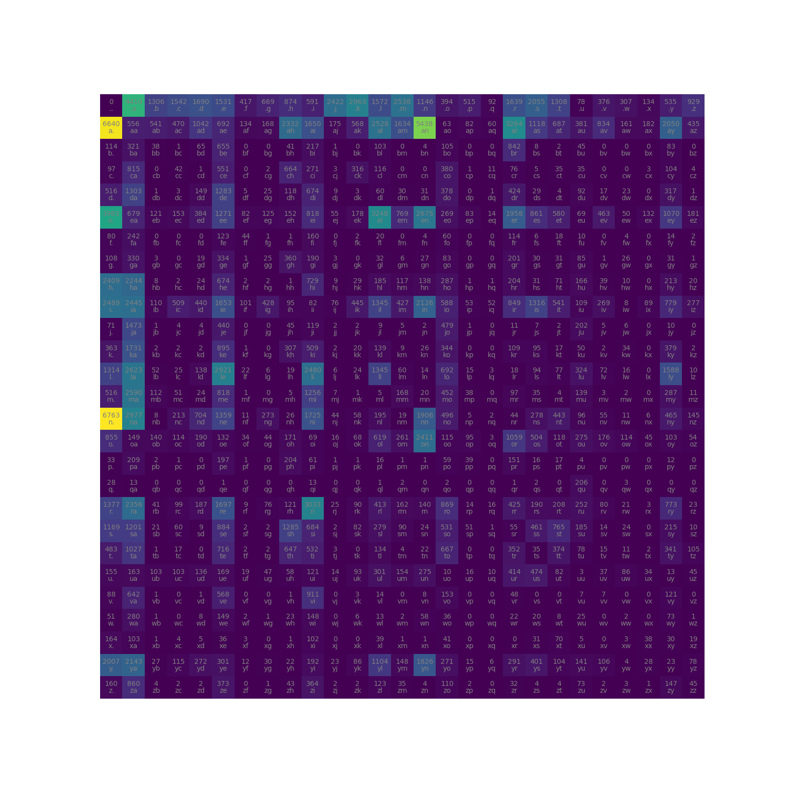

# LLM
This repository works through several iterations of a basic neural networks, starting with a basic gradient based learning algorithm without using any external libraries, to finally a WaveNet transformer model. I decided to do this to understand larger models better at the lowest level, and to improve my explanatory skills to those who do not have a technical background.

# Multi Layer Perceptron - V1

Rather than using PyTorch or library to create neural networks, I am building a rudimentary Neural Network here only using Addition, Subtraction, Multiplication, and Exponentiation. 

The first step is to create a Class which holds the data for each neuron as well as a tuple that will hold the Children neurons which created it, as well as the type of operand to get there. 

After creating a graph using the operands, I used a back propogation function to calculate the Gradient, or the the local derivative between the nodes. This gradient tells us the amount of influence each weight has on the outcome, and if tweaked how much it will change. 

After calculating the gradients, by comparing the predicted values to the wanted outcomes, I calculated a loss function. I then iterively adjust the weights using the gradient to minimize this loss function, adjusting the parameters of the model to create a better loss. 

# Predicting names using Bigrams Probabilities - V2

Using a file containing 32,000 names, I was looped through each name and kept a probability matrix of the letter and those which follow: Of the 228,146 bigrams, 'an' appeared 5438 times whereas 'qw' only twice. Below is the probability graph. 

Converting these occurrances to probabilities, I am able to predict the next letter and create somewhat convincing names. The downside to this is it can only keep one letter of context in a 27 x 27 array (26 letters and a starter/terminator character), and this array would become exponentially large.

# Predicting names using basic neural net - V3 

In this iteration, I introduced tensors to hold X (tensor containing all bigrams) and Y (tensor containing the letter which follows) and used One Hot Encodings to mulitply them into a rudimentary Linear layer, which I then was able to sample to create "Fake" names. Example output:

rie.
harimivo.
janvi.
briay.
kalys.
lmiah.
rithtikeya.
sirod.
kyn.
ho.
bivemyr.

